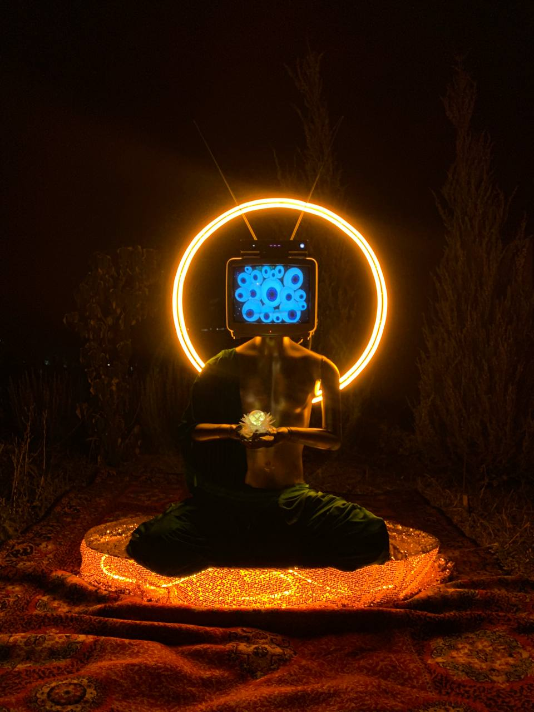

E-Budha visual instalation

This project is an interactive visual installation that employs Kinect 2.0 and advanced gesture recognition technology to create a unique and engaging experience. At the heart of the installation is a mannequin with a television for a head, designed to capture the attention and imagination of passersby.

Objective:
The goal of this project is to explore the boundaries of interactive art through the use of modern technology. By combining gesture recognition with an engaging visual setup, the installation not only entertains but also prompts viewers to consider the role of technology in our lives and how it can be used to convey messages or wisdom in novel ways.

